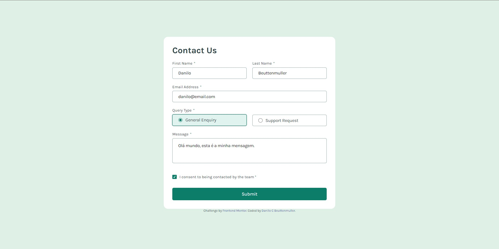

# Frontend Mentor - Contact form solution

This is a solution to the [Contact form challenge on Frontend Mentor](https://www.frontendmentor.io/challenges/contact-form--G-hYlqKJj). Frontend Mentor challenges help you improve your coding skills by building realistic projects. 

## Table of contents

- [Overview](#overview)
  - [The challenge](#the-challenge)
  - [Screenshot](#screenshot)
  - [Links](#links)
- [My process](#my-process)
  - [Built with](#built-with)
  - [What I learned](#what-i-learned)
  - [Continued development](#continued-development)

## Overview

### The challenge

Users should be able to:

- Complete the form and see a success toast message upon successful submission
- Receive form validation messages if:
  - A required field has been missed
  - The email address is not formatted correctly
- Complete the form only using their keyboard
- Have inputs, error messages, and the success message announced on their screen reader
- View the optimal layout for the interface depending on their device's screen size
- See hover and focus states for all interactive elements on the page

### Screenshot



### Links

- Live Site URL: [Link](https://danilocb21.github.io/contact-form-main/)

## My process

### Built with

- Semantic HTML5 markup
- CSS custom properties
- Flexbox

### What I learned

Aprendi a utilizar melhor o display flex, adicionar classes no objeto pelo javascript e a manipular os objetos de acordo com o que eu preciso.

```html
<div class="success">
  <div class="success-top">
    <svg xmlns="http://www.w3.org/2000/svg" width="20" height="21" fill="none" viewBox="0 0 20 21"><path fill="#fff" d="M14.28 7.72a.748.748 0 0 1 0 1.06l-5.25 5.25a.748.748 0 0 1-1.06 0l-2.25-2.25a.75.75 0 1 1 1.06-1.06l1.72 1.72 4.72-4.72a.75.75 0 0 1 1.06 0Zm5.47 2.78A9.75 9.75 0 1 1 10 .75a9.76 9.76 0 0 1 9.75 9.75Zm-1.5 0A8.25 8.25 0 1 0 10 18.75a8.26 8.26 0 0 0 8.25-8.25Z"/></svg><span>Message Sent!</span>
  </div>
  <p>
    Thanks for completing the form. We'll be in touch soon!
  </p>
</div>
```
```css
.form-item {
  display: flex;
  flex-direction: column;
  margin-left: 1rem;
  flex-grow: 1;
  flex-basis: 0;
}

.form-item:first-child {
  margin-left: 0;
}

.form-item input,
.form-item textarea,
.form-item .radiobox {
  border: 1px solid var(--color-text-light);
  border-radius: .25rem;
  height: 2rem;
  margin-bottom: .5rem;
  font-family: 'Karla';
  font-size: 15px;
  padding: .8rem 1rem;
  outline: none;
}
```
```js
document.querySelectorAll(".radiobox input[type='radio']").forEach((radio) => {
  radio.addEventListener("change", (event) => {
    document.querySelectorAll(".radiobox").forEach((radiobox) => {
      radiobox.classList.remove("active");
    });

    const radiobox = event.target.closest(".radiobox");
    if (radiobox) {
      radiobox.classList.add("active");
    }
  });
});
```
### Continued development

Preciso aprender a manipular o DOM e melhorar a forma que eu faço meu CSS, principalmente quando se trata de fazer responsividade com telas menores.
